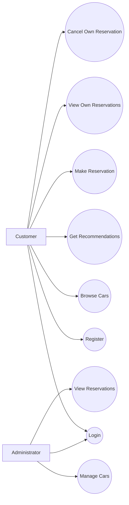
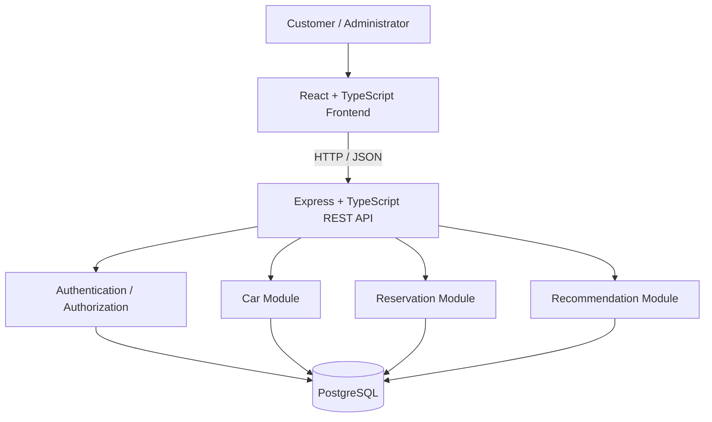
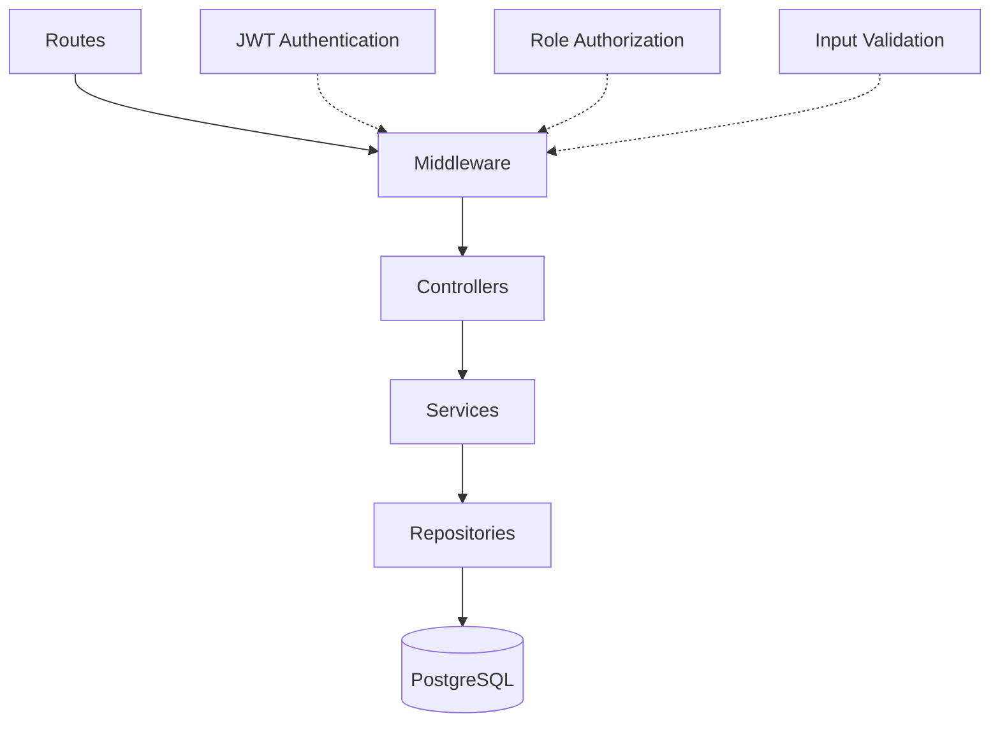
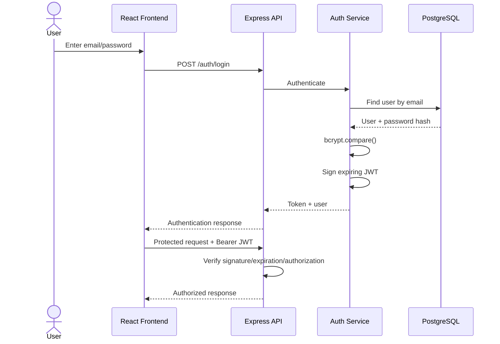
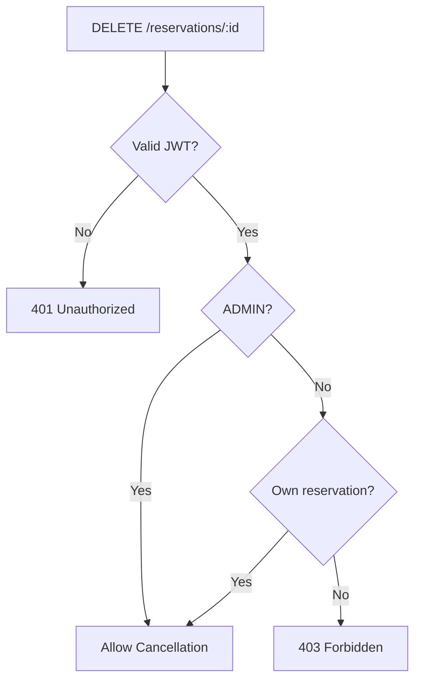
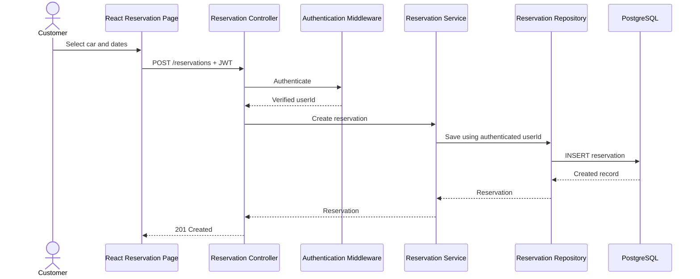
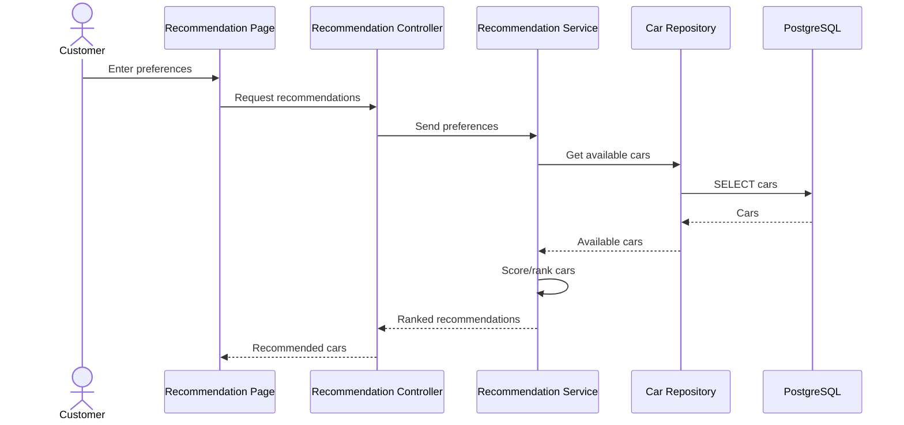
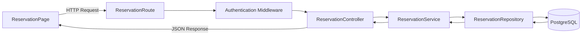
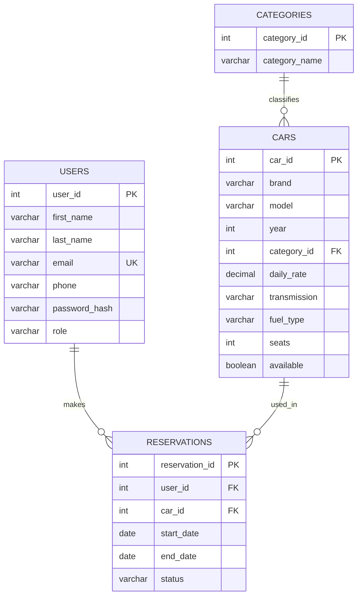

# Car Rental System

**CS425 Software Engineering Course Project**  
**Author:** Tegshbayar Ganbat

A full-stack web application for managing vehicle rentals. Customers can register, authenticate, browse vehicles, receive rule-based car recommendations, create reservations, view their own reservations, and cancel reservations they own. Administrators can securely manage vehicle inventory and reservations.

---

## 1. Project Vision

### Problem
Traditional or partially manual vehicle-rental processes can make it difficult for customers to find appropriate cars, confirm availability, and manage reservations efficiently. Rental administrators also need a consistent way to maintain vehicle inventory and reservations.

### Purpose
The Car Rental System provides a centralized web application that simplifies the rental process for customers and provides administrators with tools for managing cars and reservations.

### Scope
- Customer registration and login
- Secure password storage
- Vehicle browsing and searching/filtering
- Rule-based vehicle recommendations
- Reservation creation and cancellation
- Customer-specific reservation viewing
- Administrator vehicle and reservation management
- Role-based API authorization
- Server-side input validation

### Stakeholders
- Customers
- Car rental administrators
- Car rental business/management

### Assumptions and Constraints
- Modern web browser and PostgreSQL are available.
- Administrators are assigned the `ADMIN` role.
- React/TypeScript frontend; Node.js/Express/TypeScript backend.
- PostgreSQL relational database and REST/JSON communication.
- Modular-monolith architecture.
- Sensitive configuration is kept outside source code.

---

## 2. Software Requirements Specification

### Functional Requirements

| ID | Requirement |
|---|---|
| FR-01 | A customer can register an account. |
| FR-02 | A registered user can log in. |
| FR-03 | A user can browse available vehicles. |
| FR-04 | A user can search/filter vehicles. |
| FR-05 | A user can request vehicle recommendations. |
| FR-06 | An authenticated customer can create a reservation. |
| FR-07 | A customer can view their own reservations. |
| FR-08 | A customer can cancel a reservation they own. |
| FR-09 | An administrator can view reservations. |
| FR-10 | An administrator can add vehicles. |
| FR-11 | An administrator can update vehicles. |
| FR-12 | An administrator can remove vehicles. |
| FR-13 | Customers are prevented from using administrator-only APIs. |
| FR-14 | Customers are prevented from cancelling another customer's reservation. |

### Non-Functional Requirements
- Passwords must not be stored as plaintext.
- Protected APIs require authentication.
- Administrative operations require backend authorization.
- JWT signatures and expiration are validated.
- Database operations use parameterized SQL.
- User input is validated on the server.
- Secrets/database credentials are not committed to source control.
- Controller, service, and repository responsibilities are separated.

---

## 3. Actors and Use Cases

### Customer
Register, log in, browse/search cars, obtain recommendations, make a reservation, view own reservations, and cancel own reservations.

### Administrator
Log in, add/update/remove cars, view reservations, and perform permitted reservation-management operations.



---

## 4. System Architecture

The application is implemented as a **modular monolith**. The React frontend communicates with a Node.js/Express REST API. Backend modules share PostgreSQL.



### Technology Stack

| Area | Technology |
|---|---|
| Frontend | React, TypeScript, Vite |
| Routing | React Router |
| HTTP Client | Axios |
| Backend | Node.js, Express.js, TypeScript |
| Database | PostgreSQL |
| Persistence | `pg` with parameterized SQL |
| Password Security | bcrypt |
| Authentication | JWT |
| Validation | express-validator |
| Testing | Postman; automated tests to be verified/added |
| Version Control | Git / GitHub |

---

## 5. Layered Backend Design



### Controller Layer
`backend/src/controllers/` handles HTTP requests/responses and delegates business logic.

### Service Layer
`backend/src/services/` contains authentication, car, reservation, ownership, and recommendation business rules.

### Repository Layer
`backend/src/repositories/` performs PostgreSQL operations with `pg` and parameterized SQL. This is the technology-appropriate persistence mechanism used instead of Spring Data JPA.

---

## 6. Authentication and Authorization



Passwords are hashed with **bcrypt**. Protected requests use a Bearer JWT. The backend distinguishes `CUSTOMER` and `ADMIN` roles and enforces authorization server-side.

### Reservation Ownership



---

## 7. Reservation Sequence



The backend derives the reservation owner from the verified JWT rather than trusting a client-supplied `user_id`.

---

## 8. Recommendation Sequence

The current recommendation feature is an internal rule-based TypeScript engine, not an external LLM/API.



---

## 9. Collaboration / VOPC View



---

## 10. Entity and Database Design



---

## 11. Main API Endpoints

### Authentication
| Method | Endpoint | Access | Purpose |
|---|---|---|---|
| POST | `/auth/register` | Public | Register customer |
| POST | `/auth/login` | Public | Authenticate and issue JWT |

### Cars
| Method | Endpoint | Access | Purpose |
|---|---|---|---|
| GET | `/cars` | Public | Retrieve cars |
| GET | `/cars/:id` | Public | Retrieve one car |
| POST | `/cars` | ADMIN | Add car |
| PUT | `/cars/:id` | ADMIN | Update car |
| DELETE | `/cars/:id` | ADMIN | Remove car |

### Reservations
| Method | Endpoint | Access | Purpose |
|---|---|---|---|
| GET | `/reservations` | Authenticated | Customer sees own; Admin sees all |
| POST | `/reservations` | Authenticated | Create reservation |
| DELETE | `/reservations/:id` | Owner / ADMIN | Cancel reservation |

### Recommendations
| Method | Endpoint | Access | Purpose |
|---|---|---|---|
| GET | `/recommendations` | Public | Retrieve recommended cars |

---

## 12. Functional Demonstration

**Customer:** Register → Login → Browse Cars → Get Recommendations → Create Reservation → View Own Reservations → Cancel Own Reservation

**Administrator:** Admin Login → Authorization → Admin Page → Add/Update/Delete Cars → View/Manage Reservations

Security-sensitive behavior is enforced by the backend, not only by hidden React components.

---

## 13. Testing and Validation

Manual UI/Postman validation performed during development includes:

| Test | Expected Result |
|---|---|
| Valid credentials | JWT returned |
| Wrong credentials | Authentication rejected |
| Invalid registration input | Validation error |
| Protected request without JWT | `401 Unauthorized` |
| Customer calls Admin API | `403 Forbidden` |
| Admin calls Admin API | Allowed |
| Customer requests reservations | Own reservations only |
| Customer cancels own reservation | Allowed |
| Customer cancels another user's reservation | `403 Forbidden` |
| Invalid/expired JWT | `401 Unauthorized` |

### Automated Testing Status
The rubric requires meaningful automated tests with assertions for normal, boundary, and error cases. **Automated tests must be present and passing before final submission to claim full credit for this criterion.** This README does not claim automated coverage unless those tests exist in the repository.

---

## 14. Project Structure

```text
cs425-car-rental-system/
├── backend/
│   ├── src/
│   │   ├── controllers/
│   │   ├── middleware/
│   │   ├── models/
│   │   ├── repositories/
│   │   ├── routes/
│   │   ├── services/
│   │   ├── db/
│   │   ├── app.ts
│   │   └── server.ts
│   ├── database/
│   ├── package.json
│   └── tsconfig.json
├── frontend/
│   ├── src/
│   │   ├── components/
│   │   ├── pages/
│   │   └── services/
│   └── package.json
├── Labs/
├── README.md
└── .gitignore
```

---

## 15. Local Installation

### Prerequisites
- Node.js 20+
- npm
- PostgreSQL 16+
- Git

### Clone
```bash
git clone https://github.com/tegsheenee/cs425-car-rental-system.git
cd cs425-car-rental-system
```

### Database
```sql
CREATE DATABASE car_rental_db;
```

### Backend Environment
Create `backend/.env`:

```env
PORT=3000
DB_HOST=localhost
DB_PORT=5432
DB_NAME=car_rental_db
DB_USER=your_postgresql_username
DB_PASSWORD=your_postgresql_password
JWT_SECRET=replace_with_a_long_random_secret
```

Never commit the real `.env` file.

### Start Backend
```bash
cd backend
npm install
npm run dev
```

Default backend: `http://localhost:3000`

### Start Frontend
```bash
cd frontend
npm install
npm run dev
```

Typical Vite frontend: `http://localhost:5173`

---

## 16. Secure Configuration

The `.gitignore` should exclude:

```gitignore
.env
backend/.env
node_modules/
.idea/
*.iml
dist/
backend/dist/
frontend/dist/
.DS_Store
```

Database passwords and JWT signing secrets remain in environment variables.

---

## 17. Architectural Decisions

- **Modular monolith:** clear modules without unnecessary distributed-system complexity.
- **React:** reusable client UI and routing.
- **Express:** REST endpoints and middleware for authentication/authorization/validation.
- **Layered backend:** separates HTTP, business, and persistence responsibilities.
- **PostgreSQL:** appropriate for relational users/cars/reservations.
- **Direct parameterized SQL:** implemented using `pg` rather than an ORM.
- **JWT + bcrypt:** secure password storage and authenticated API access.

---

## 18. Rubric Traceability

| Rubric Criterion | Project Evidence |
|---|---|
| 1. Vision Document | Section 1 and project Vision documentation |
| 2. SRS and Use-Case Model | Sections 2–3 and SRS document |
| 3. Architecture and UML Diagrams | Sections 4, 6–10 and project diagram files |
| 4. Controller Layer | `backend/src/controllers/` |
| 5. Service Layer | `backend/src/services/` |
| 6. Repository Layer | `backend/src/repositories/` with PostgreSQL `pg` |
| 7. Entity and Database Design | Section 10 and PostgreSQL schema |
| 8. Functional Application Demonstration | Section 12 and running UI |
| 9. Testing | Section 13; automated tests required for full rubric compliance |
| 10. GitHub and Code Quality | Repository structure, README, setup instructions, `.gitignore` |
| 11. Presentation and Technical Understanding | Architecture/design documentation and presentation |

---

## 19. Extra-Credit Security

### Authentication and Secure Password Storage
- bcrypt password hashing
- JWT authentication
- JWT signature and expiration verification
- Signing secret kept outside source code

### Server-Side/API Authorization
- Protected endpoints
- `ADMIN` role checks
- Reservation ownership checks
- Server-side input validation
- Environment-variable handling for secrets

The frontend may hide unauthorized controls for usability, but backend authorization is the actual security boundary.

---

## 20. Future Enhancements
- Public cloud deployment
- Managed cloud PostgreSQL
- Expanded automated test suite
- Payment integration
- Email/SMS notifications
- More advanced recommendations
- Analytics dashboard
- Mobile client

---

## Author

**Tegshbayar Ganbat**  
CS425 Software Engineering  
Car Rental System
